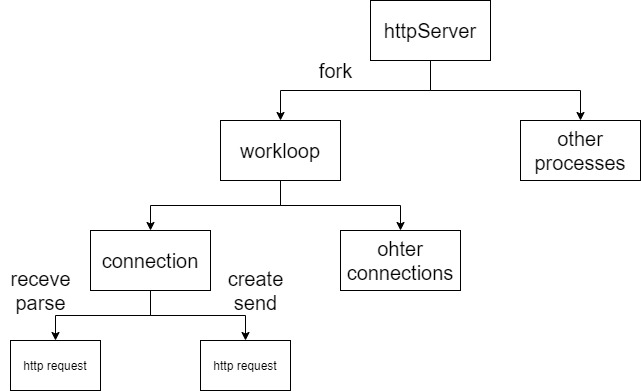

轻量的Linux多进程HTTP服务器。基于epoll和reuseport构建的per process per loop 模型。现支持长连接、文件传输，目前仅支持静态GET请求，但提供POST请求体的读取和CGI程序请求和参数传递接口。

   * [使用指南](#使用指南)
      * [环境需求](#环境需求)
      * [编译帮助](#编译帮助)
         * [编译前](#编译前)
         * [编译命令](#编译命令)
      * [使用静态文件创建服务器](#使用静态文件创建服务器)
      * [运行实例](#运行实例)
   * [项目结构](#项目结构)
      * [文件结构](#文件结构)
      * [实现结构](#实现结构)
   * [未实现](#未实现)

## 使用指南

### 环境需求
 
项目于以下环境中开发且通过运行测试

- OS: Ubuntu 18.04
- Compiler: g++ 9.3.0
- Cmake 3.16.3

项目环境需求最低条件

- OS: Linux 内核版本 >= 4.6
- Compiler: 支持 C++ 14
- Cmake 3.5+

### 编译帮助

#### 编译前
项目无需链接任何系统库及第三方库
在工作目录下创建"build"目录(存储编译缓存文件)和在项目文件目录"bin" 目录(输出二进制文件)

#### 编译命令
``` shell 
cmake . -B build
make -C build
```
编译完成后可在bin目录下找到可执行文件

### 使用静态文件创建服务器
需要包含必要的h文件与cpp文件
``` cpp
//服务器头文件
#include "httpServer.h"
//获取系统类(单例模式) 初始化并设置fork出1个子进程(默认为3)
httpServer::getServer().init(1);
//绑定HTTP服务器目录，实例中为可执行文件同目录下"demo"目录
httpServer::getServer().setPath(get_currentPath()+"demo");
//默认设置
//设置主页面
//httpServer::getServer().setIdxFile("index.html");
//设置IP地址及端口号
//httpServer::getServer().setIP("0.0.0.0",8081);
//运行服务器
httpServer::getServer().run();
```

### 运行实例
项目提供一个已构建完成的实例，通过浏览器访问主页，可得到以下内容


## 项目结构

### 文件结构
``` txt
htttpServer
|- images
|- instance 
|- server
||- include
|||- connection.h # 提供HTTP连接传输的各类方法
|||- epollManager.h # RALL风格epoll管理类，封装epoll各类函数
|||- fileManager.h # RALL风格file管理类，封装本地文件的访问
|||- httpDefinition.h # 各类HTTP状态量定义
|||- httperror.h  # 错误显示，未来可用作日志功能
|||- httpRequest.h # HTTP请求类
|||- httpRequestParser.h # 提供对HTTP请求的解析方法
|||- httpResponce.h # HTTP响应
|||- httpServer.h # 核心头文件
|||- serverConfig.h # 通过httpServer进行修改，为其他类提供server配置的中间类
|||- Socket.h # RALL风格socket管理类，封装socket各类操作
|||- workLoop.h # 工作循环
||- src
|||- *.cpp # 实现文件
| CMakeLists.txt
| LICENSE
| README.md      
| .gitignore
```
### 实现结构

主进程fork出多个工作子进程，每个子进程拥有一个listen socket 监听同一个地址和端口，拥有一个epoll循环。


## 未实现

循环内的计时器(现阶段可能导致一个连接长时间停留占用资源)
日志功能